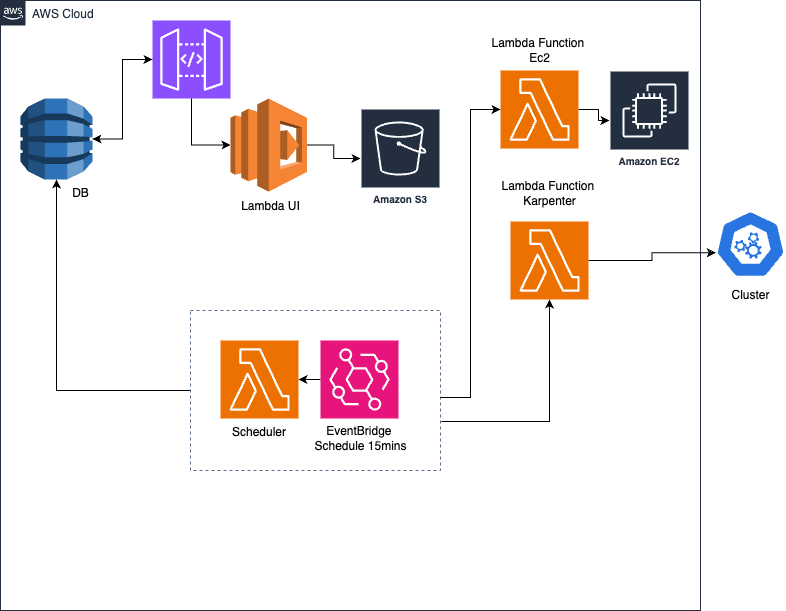

This is a [MoonRepo](https://moonrepo.dev/) Monorepo with Lambda functions in Rust(Mostly) and Web UI in NextJs built to run serverless to enable scheduling and control on Kubernetes Clusters.


## Features

- [ ] Web Client 
  - [x] View Schedules default and custom
  - [x] Turn On / Off clusters
  - [x] Edit default and custom schedules
  - [ ] Disable / Enable Schedules on UI
  - [ ] Scale capacity up / down
  - [ ] Add Current state status icons for kubernetes clusters
- [ ] Lambda functions
  - [x] Function to control Karpenter nodes
  - [x] Function to Terminate EC2 instance
  - [x] Function to act as a scheduler to trigger Scaling / On - Off
  - [ ] Fucntion to set capacity manually
  - [ ] Change Karpenter nodes function to Rust
- [ ] Slack Integration
  - [ ] Change schedules and scaling from slack
  - [ ] Notifications for lambda functions

## Getting Started

#### Running the apps for development:
Run these commands from the project root

1. **EC2 Lambda function**

```bash
moon run ec2:dev    
```
2. **Karpenter Lambda function**

```bash
moon run karpenter:dev    
```
3. **Scheduler**

```bash
moon run scheduler:dev    
```
4. **Web Client**

```bash
moon run client:dev    
```
Open [http://localhost:3000](http://localhost:3000) with your browser to see the result.

## Deployment Steps

1. Build and deploy the EC2 Lambda function
 -  ```moon run ec2:deploy ```
 -  note the **function url** from the output
2. Build and deploy the Karpenter Lambda function
 -  ```moon run karpenter:deploy ```
 -  note the **function url** from the output    
3. Edit deployment yml and deploy Scheduler Lambda Function
 - Edit ```apps/scheduler/moon.yml```
 -  Add the right function Urls to the var names and check table name to be correct.
 - go back to the root directory and run ```moon run scheduler:deploy ```  
4. Deploy the web client
 - ```moon run client:deploy ```
 - **Note** the eksScalerWebClient URL 


## Architecture
